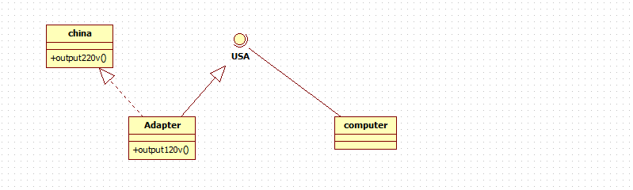

### PHP设计模式之适配器模式

1. 生活场景问题引入：

假如需要去国外旅游，游玩，现在电子产品很丰富，但是每个电子产品都是需要电源来做驱动，手机，电脑，相机。。。但是又有一个很显示的问题，电子产品是
很消耗电量的，电量没有了，就需要充电，在我们国家，我们买的电子产品出场带的电源充电器，一般都是220V的电压，但是世界很大，每个国家的要求（规定）
又是不同的，比如美国就是120V

2. 原理：

将一个类的接口转换为另外一种接口，让原本接口不兼容的类可以兼容。

用户调用适配器转化出来的目标接口方法，适配器再去调用被适配者的相关接口方法

3. 好处：

用户是看不到被适配者，属于解耦的操作

4. 适配器模式属于结构型的设计模式

5. 适配器模式的三种实现方式：

5.1 类适配器



根据上面的UML图，我们可以看出，需要一个美国电压的接口`UsaInterface`，一个适配器类`Adapter`，一个中国电压的接口`Chine`，一个使用者`Computer`，
在这里，中国电压就是被适配者，美国电压是最后的输出（目标），就是是配置者

```php
interface UsaInterface
{
    public function outPut5V();
}

class China
{
    private $voltage = 220;

    public function outPut220V()
    {
        return $this->voltage;
    }
}

class Adapter extends China implements UsaInterface
{

    public function outPut5V()
    {
        // TODO: Implement outPut5V() method.
        $chinaVoltage = $this->outPut220V();

        return $chinaVoltage / 2 + 10 . "V";
    }
}

class Computer
{
    public function index(UsaInterface $usa)
    {
        if ($usa->outPut5V() === "120V") {
            printf("可以在美国使用中国的电源插头给电脑充电了");
        } else {
            printf("不可以在美国使用中国的电源插头给电脑充电了");
        }
    }
}

class Client
{
    public function __construct()
    {
        $adapter = new Adapter();
        $computer = new Computer();

        $computer->index($adapter);
    }
}
```

5.2 对象适配器模式

对象适配器其实就是在类适配器的模式上做了一个调整，让适配器类`Adapter`不去继承被适配者的类，而是让它们组合在一起，这样就可以增加了使用的灵活
度，也不会暴露被适配者的很多方法(使用关联关系来代替继承关系【合成复用原则】)。同时，没有继承就没有办法去覆盖父类的方法重写了，也算是有好有坏吧。如下：

```php
class Adapter implements UsaInterface
{
    protected $china;

    public function __construct(China $china)
    {
        $this->china = $china;
    }


    public function outPut5V()
    {
        // TODO: Implement outPut5V() method.
        $chinaVoltage = $this->china->outPut220V();

        return $chinaVoltage / 2 + 10 . "V";
    }
}
```

5.3 接口适配器（缺省适配器模式）

当不需要全部实现接口提供的方法时，可以先设计一个抽象类实现接口，并为接口提供默认的的空方法实现，那么改抽象类的子方法就可以有选择的覆盖父类的某
些方法来实现需求，（适用于一个接口不想使用所有的方法的情况）


