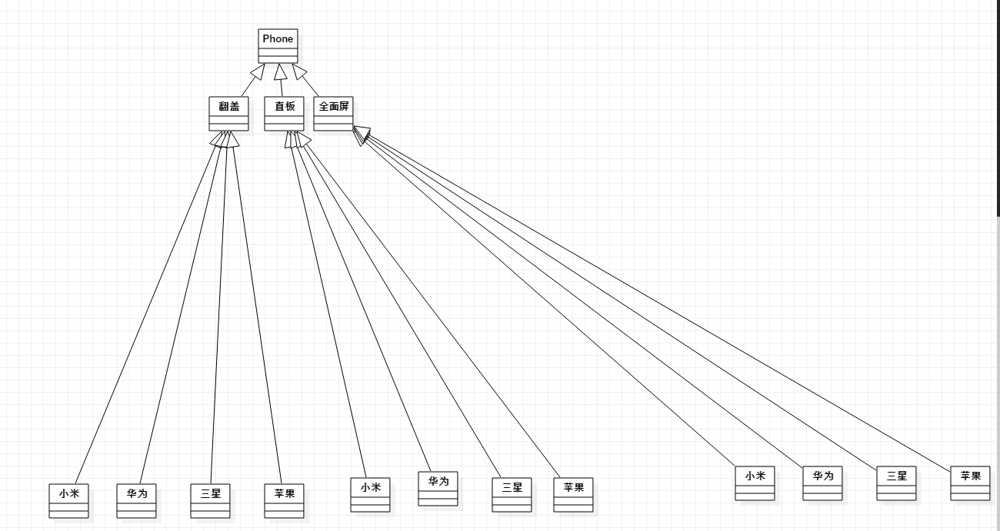
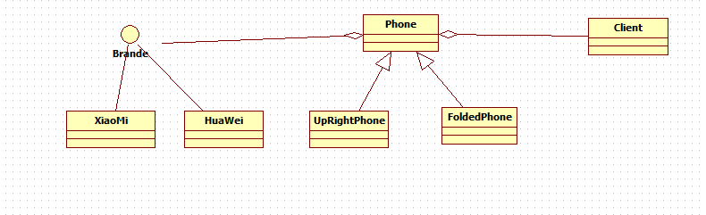

### 桥接模式 Bridge

* 桥接模式属于结构型的设计模式

* 将实现与抽象放在两个不同的类层次中，使两个层次可以独立改变

* bridge 模式是基于最小设计原则，通过封装，聚合及继承等行为让不同的类承担不同的职责，主要的特点就是将抽象与实现分离，从而保证各部分的独立性以及应对
他们功能的扩展

1. 生活场景引入：

> 现在的生活都离不开手机，手机中又有不同的品牌，小米，华为，三星，苹果。每一种手机的设计又不一样，比如最开始的翻盖手机，直板手机，到现在的全面屏手机，
假如现在的每个手机厂商都是最开始从翻盖手机做起，虽然手机的样子不一样，但是手机的主要功能还是没有变的，[开机，打电话，发短信，关机]这些个最基本的功能
都是会有的。那么如果不适用设计模式来解决这个问题，我们就会有一下的方式：有一个手机的基类，定义了手机的基本功能，然后是各大品牌厂商继承这个积累做手机，
最后厂商根据不同形态的手机做出对应的定制化的手机功能，如果未来发展需要做一款，隐形手机，那么就需要再去加一个隐形收的模板，最后，各大厂商再去继承这个隐
形手机的模板，再去做适配，要添加很多东西去适配，不利于维护和发展，而且如果还要再去加一个功能，那么每个手机都要去加这个功能，很难维护



2. 根据以上场景的导入，现在就有了桥接模式为我们程序解决这个问题。



* 定义一个品牌接口类，里面实现了`call(), open(), close()`这些基本的手机都有的功能，之后由品牌，小米，华为，苹果去实现接口

```php
interface BrandInterface
{
    public function call();

    public function open();

    public function close();
}

class XiaoMiBrand implements BrandInterface
{

    public function call()
    {
        // TODO: Implement call() method.
        printf("小米手机打电话\n");
    }

    public function open()
    {
        // TODO: Implement open() method.
        printf("小米手机开机\n");
    }

    public function close()
    {
        // TODO: Implement close() method.
        printf("小米手机关机\n");
    }
}

class HuaWeiBrand implements BrandInterface
{

    public function call()
    {
        // TODO: Implement call() method.
        printf("华为手机打电话\n");
    }

    public function open()
    {
        // TODO: Implement open() method.
        printf("华为手机开机\n");
    }

    public function close()
    {
        // TODO: Implement close() method.
        printf("华为手机关机\n");
    }
}
```

* 定义一个抽象类（手机抽象类），在这个抽象类中，首先聚合了品牌`Brand`,然后定义手机的`call(),open(),close()`方法，对应的方法里，都是聚合
`Brand`接口的抽象类实现调用的。

* 最后是继承抽象类的直板手机，折叠手机和全面屏手机，根据不同样式的手机再做定制化的功能

```php
abstract class Phone
{
    protected $brand;

    public function __construct(BrandInterface $brand)
    {
        $this->brand = $brand;
    }

    public function open()
    {
        $this->brand->open();
    }

    public function close()
    {
        $this->brand->close();
    }

    public function call()
    {
        $this->brand->call();
    }
}

class FoldedPhone extends Phone
{
    public function open()
    {
        parent::open(); // TODO: Change the autogenerated stub

        printf("折叠样式手机\n");
    }

    public function close()
    {
        parent::close(); // TODO: Change the autogenerated stub

        printf("折叠样式手机\n");
    }

    public function call()
    {
        parent::call(); // TODO: Change the autogenerated stub

        printf("折叠样式手机\n");
    }
}

class UpRightPhone extends Phone
{
    public function open()
    {
        parent::open(); // TODO: Change the autogenerated stub

        printf("直板样式手机\n");
    }

    public function close()
    {
        parent::close(); // TODO: Change the autogenerated stub

        printf("直板样式手机\n");
    }

    public function call()
    {
        parent::call(); // TODO: Change the autogenerated stub

        printf("直板样式手机\n");
    }
}
```

* 这里抽象类`Phone`就是一个桥梁，它并没有具体实现自己的方法，只是动态的调用不同品牌手机的对应方法

* 测试调用

```php
class Client
{
    public function __construct()
    {
        $phone1 = new FoldedPhone(new XiaoMiBrand());

        $phone1->call();

        $phone1->open();

        $phone1->close();
        printf("============================\n");
        $phone2 = new FoldedPhone(new HuaWeiBrand());

        $phone2->call();

        $phone2->open();

        $phone2->close();
        printf("============================\n");
        $phone3 = new UpRightPhone(new HuaWeiBrand());

        $phone3->open();

        $phone3->call();

        $phone3->close();
    }
}

require './../vendor/autoload.php';

new Client();
```

* 输出结果

```php
//小米手机打电话
//折叠样式手机
//小米手机开机
//折叠样式手机
//小米手机关机
//折叠样式手机
//============================
//华为手机打电话
//折叠样式手机
//华为手机开机
//折叠样式手机
//华为手机关机
//折叠样式手机
//============================
//华为手机开机
//直板样式手机
//华为手机打电话
//直板样式手机
//华为手机关机
//直板样式手机

```

3. 一般框架中实际案例：

* 定义了一个 `ConnectionInterface`连接接口，`Connection`实现了连接接口
```php
interface ConnectionInterface
{

}

class Connection implements ConnectionInterface
{

}
```

* 下面是`mysql, pgslq, sqLite, sqServer`具体的实现

```php
class MySqlConnection extends Connection
{

}

class PostgresConnection extends Connection
{

}

class SQLiteConnection extends Connection
{

}

class SqlServerConnection extends Connection
{

}
```

* 定义一个`Builder`类，在构造方法中，传入`ConnectionInterface`接口。`Builder`类就相当于一个桥

```php
class Builder
{
    protected $connection;
    
    public function __construct(ConnectionInterface $connection)
    {
        $this->connection = $connection;
    }

    
    public function cursor()
    {
        if (is_null($this->columns)) {
            $this->columns = ['*'];
        }

        return $this->connection->cursor(
            $this->toSql(), $this->getBindings(), ! $this->useWritePdo
        );
    }

    public function exists()
    {
        $results = $this->connection->select(
            $this->grammar->compileExists($this), $this->getBindings(), ! $this->useWritePdo
        );

        // If the results has rows, we will get the row and see if the exists column is a
        // boolean true. If there is no results for this query we will return false as
        // there are no rows for this query at all and we can return that info here.
        if (isset($results[0])) {
            $results = (array) $results[0];

            return (bool) $results['exists'];
        }

        return false;
    }

    public function update(array $values)
    {
        $sql = $this->grammar->compileUpdate($this, $values);

        return $this->connection->update($sql, $this->cleanBindings(
            $this->grammar->prepareBindingsForUpdate($this->bindings, $values)
        ));
    }

    //......还有很多
}
```
